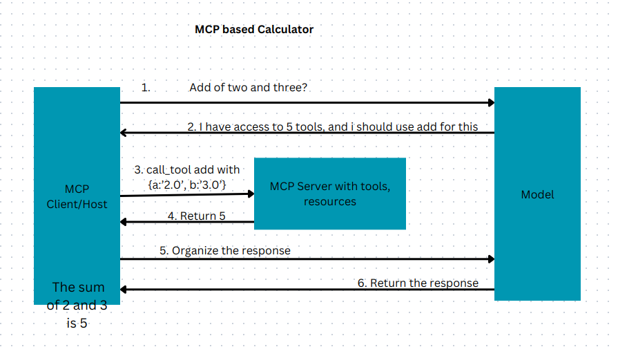
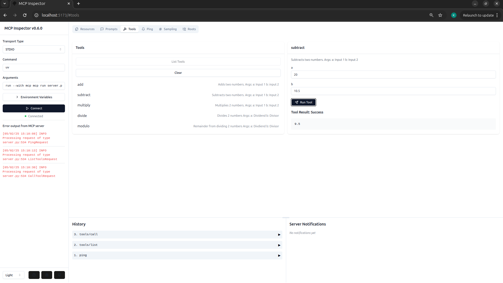

# A simple calculator app using Model Context protocol

#### Purpose of this repo
To explore basic building blocks of MCP and intricacies of tool calling within MCP, from scratch. Keeping it as simple as possible without handling many edge cases. Understand how to build both MCP Server and clients.

#### Core Features
<li> A calculator app to do add, subtract, multiply, divide and modulo</li>
<li> Debugging server using MCP Inspector </li
<li> A MCP-based client that takes a query from the user to perform the above mentioned operations </li>

#### Future possibilities for quick concept exploration
<li>Sequential tool calling</li>
<li> Storage of previous chat history is not supported to maintain simplicity </li>
<li> Input validation by server and/or client </li>
 

<b> 🚨 Most of the technolgies used in this repo like FastMCP, tool calling in anthropic and MCP itself are very recent. So there are some features in these technologies that are either not available or buggy. But the main goal is a simple exploration without using cursor or Claude Desktop 🚨 </b>

#### MCP compliant Calculator Server
Is built using FastMCP, due to its simplicty and automatic error handling. 
Points to remember:-
<li> Always name the server either as mcp or server or app. Throws an error otherwise and is quite explicit </li>
<li>Annotations can be included as a future reference. Right now it is not supported in FastMCP for the version in uv.lock</li>

#### MCP client
Makes a connection to MCP server and should have access to LLM
Would higly suggest to explore and inspect the objects returned when the model uses a tool and a genertic reponse
Try to stress test giving numbers in different format. 
Eg:- Add 2 and 3 v/s Add two and three.
Eg:- Try to use ambiguous and large numbers:- Add seven hundred thousand trillion with three hundred billion

#### Workflow overview

#### To reproduce the working environment whre .toml file is located 
`uv sync`

#### TO activate the working environment use
`source .venv/bin/activate`

#### To simply inspect the server
Go to fastmcp_calculator_server folder and run  
`mcp dev server.py`

Add your anthropic API key to .env file

#### To run the whole MCP app
Go to mcp_calculator/mcp_compliant_client and run  
`python client.py <path to server.py>`

More about this on <a href='https://medium.com/@keerthi.ningegowda/mcp-to-fix-mcp-model-context-protocol-solves-most-common-problems-part-2-35348a08ae0d'> medium. </a>
